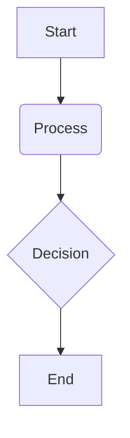

# {{CHAPTER_TITLE}}

## Overview

{{OVERVIEW_CONTENT}}

## Key Concepts

{{KEY_CONCEPTS_CONTENT}}

## Subsections

### {{SUBSECTION_TITLE_1}}

{{SUBSECTION_CONTENT_1}}

### {{SUBSECTION_TITLE_2}}

{{SUBSECTION_CONTENT_2}}

## Learning Goals

- {{LEARNING_GOAL_1}}
- {{LEARNING_GOAL_2}}

## Mini Diagram



## Short Example

```python
# Example code snippet
print("Hello, Physical AI!")
```

## References

- [Source 1](https://example.com/source1) (APA Style)
- [Source 2](https://example.com/source2) (APA Style)
