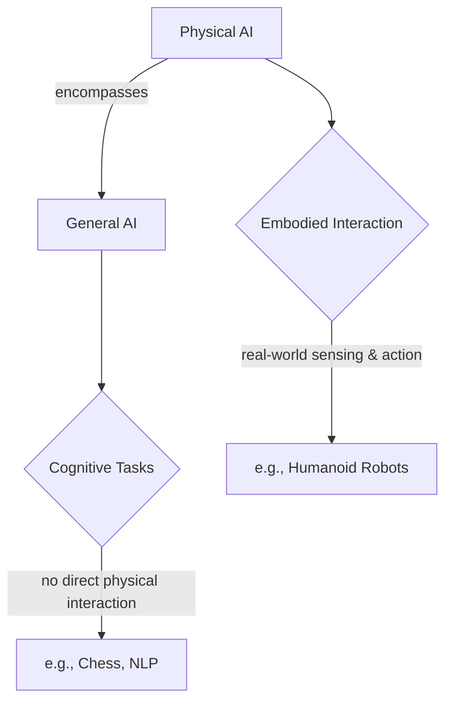

# What Is Physical AI?

## Overview

This chapter introduces the fundamental concept of Physical AI, exploring how intelligent systems interact with the physical world. We will differentiate Physical AI from general AI and delve into the principles of embodied intelligence. The chapter also highlights the significance of humanoid robots in this domain and provides examples of modern embodied AI systems, setting the stage for understanding the unique challenges and opportunities in integrating AI with physical robotics.

## Key Concepts

- **Physical AI**: Intelligent systems designed to perceive, reason, and act within the physical world, often through robotic embodiments.
- **Embodied Intelligence**: The idea that an agent's intelligence is profoundly shaped by its physical body and its interactions with the environment.
- **Humanoid Robots**: Robots designed to mimic the human form, enabling them to operate in human-centric environments and perform complex manipulation tasks.
- **General AI vs. Physical AI**: General AI often focuses on cognitive tasks (e.g., natural language processing, game playing) without direct physical interaction, while Physical AI emphasizes real-world sensing and action.

## Subsections

### AI vs. Physical AI

Artificial Intelligence (AI) encompasses a broad range of technologies enabling machines to simulate human intelligence. This includes areas like machine learning, natural language processing, computer vision, and expert systems. While many AI applications operate purely in the digital realm, Physical AI extends these capabilities into the real world. Physical AI systems are embodied—they possess a physical form (like a robot) that allows them to interact directly with their environment, perceive through physical sensors, and act through motors and actuators. This embodiment introduces unique challenges and requirements related to physics, real-time control, safety, and adaptation to unpredictable physical conditions.

### Embodied intelligence principles

Embodied intelligence posits that the physical body of an agent and its interactions with the environment are integral to its cognitive processes. Rather than treating the body as a mere container for a disembodied mind, embodied intelligence recognizes that perception, action, and cognition are deeply intertwined. Key principles include the idea that intelligence emerges from the interplay between the brain, body, and environment; that actions are often goal-directed and driven by sensory feedback; and that the morphology of the body itself can simplify control and perception tasks. For humanoid robots, this means their human-like form can facilitate interaction with tools and environments designed for humans, but also demands sophisticated control to manage their complex degrees of freedom and maintain balance.

### Why humanoid robots matter

Humanoid robots hold significant importance in the field of Physical AI due to their potential to operate in environments designed for humans, such as homes, workplaces, and disaster zones. Their bipedal locomotion, articulated arms, and dexterous hands allow them to navigate stairs, open doors, use human tools, and perform tasks that require fine manipulation. Beyond practical applications, humanoid robots serve as a crucial platform for studying embodied intelligence, human-robot interaction, and developing more general-purpose AI that can adapt to the complexities of the human world. Their development pushes the boundaries of perception, control, and decision-making in highly dynamic and unstructured settings.

### Examples of modern embodied AI systems

Modern embodied AI systems span a wide range of applications, from industrial automation to advanced research platforms. Examples include:

- **Boston Dynamics' Spot and Atlas**: Robotic platforms demonstrating advanced locomotion, balance, and manipulation in challenging terrains, often integrating sophisticated perception and planning algorithms.
- **Tesla Bot (Optimus)**: An ongoing project aiming to develop a general-purpose humanoid robot for a variety of tasks, leveraging Tesla's expertise in AI and autonomous systems.
- **Robots in logistics and warehouses**: Automated guided vehicles (AGVs) and autonomous mobile robots (AMRs) that navigate and transport goods in structured environments, showcasing efficient physical interaction and path planning.
- **Surgical robots (e.g., Da Vinci System)**: Although not humanoid, these systems are prime examples of embodied AI assisting with precise physical tasks, guided by human operators but enhancing dexterity and accuracy. These examples illustrate the diverse forms and applications of AI acting in the physical world.

## Learning Goals

- Understand the definition and motivation behind Physical AI.
- Recognize why humanoid robots require intelligence aligned with the physical world.

## Mini Diagram



## Short Example

```python
# Conceptual representation of a robot perceiving and acting
class Robot:
    def __init__(self, name):
        self.name = name

    def perceive(self):
        print(f"{self.name} is sensing the environment...")
        # In a real robot, this would involve sensor readings (e.g., camera, lidar)

    def act(self, action):
        print(f"{self.name} is performing action: {action}")
        # In a real robot, this would involve sending commands to actuators

if __name__ == "__main__":
    humanoid = Robot("Optimus")
    humanoid.perceive()
    humanoid.act("grasp object")

```

## References

- [APA citation for: General AI concepts] (This would be replaced by actual APA citations)
- [APA citation for: Embodied intelligence literature]
- [APA citation for: Humanoid robot significance]
- [APA citation for: Examples of embodied AI systems]

import LikeButton from '@site/src/components/LikeButton';

<LikeButton />
