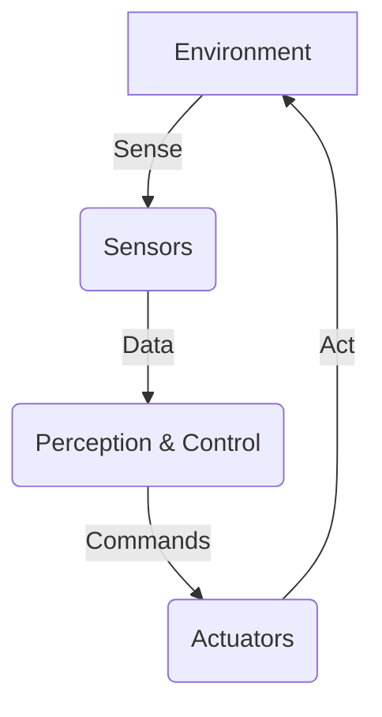

# Robotics Foundations

## Overview

This chapter lays the groundwork for understanding how physical robotic systems operate. We will explore the essential components that enable robots to interact with their environment, focusing on sensors for perception and actuators for action. Key concepts such as kinematics, dynamics (conceptually, without deep mathematical derivations), and control loops will be introduced to establish a fundamental mental model of robot behavior. This foundational knowledge is crucial for comprehending the more advanced topics covered in subsequent modules, including simulation and AI integration.

## Key Concepts

- **Sensors**: Devices that detect and measure physical properties from the environment (e.g., light, distance, touch) and convert them into signals that a robot can interpret.
- **Actuators**: Components that enable a robot to perform physical actions by converting energy into mechanical motion (e.g., motors, servos, hydraulic cylinders).
- **Kinematics**: The study of motion without considering the forces that cause it. In robotics, it describes the geometry of motion for robot arms and manipulators.
- **Dynamics**: The study of motion considering the forces and torques that cause it. It involves analyzing how forces affect a robot's acceleration and movement.
- **Control Loops**: A system that continuously monitors a robot's state, compares it to a desired state, and adjusts actuators to minimize the difference, thereby achieving a controlled behavior.

## Subsections

### Sensors and perception basics

Robots perceive their environment through a variety of sensors, which act as their "eyes" and "ears." Common sensor types include cameras (for visual information), LiDAR (for precise distance measurements and mapping), ultrasonic sensors (for proximity detection), and IMUs (Inertial Measurement Units, for orientation and acceleration). The data collected by these sensors is processed to build an internal representation of the world, a process known as perception. This perception allows robots to understand their surroundings, locate objects, detect obstacles, and track their own position, which are all critical for intelligent behavior in the physical world.

### Actuators, motors, servos

Actuators are the muscles of a robot, enabling it to move and manipulate objects. Electric motors are the most common type of actuator in robotics, converting electrical energy into mechanical energy. Servos are a specific type of motor assembly that allows for precise control over angular position, making them ideal for robot joints. Other actuators include hydraulic and pneumatic systems for heavy-duty applications. The selection and control of actuators are vital for a robot's dexterity, strength, speed, and overall ability to perform tasks effectively and safely in its environment.

### Kinematics & dynamics (conceptual, not mathematical)

Kinematics describes the motion of a robot's body parts without considering the forces involved. Forward kinematics determines the end-effector's position and orientation given the joint angles, while inverse kinematics calculates the joint angles required to achieve a desired end-effector pose. Dynamics, on the other hand, deals with the relationship between forces, torques, and the resulting motion. It's crucial for understanding how to control a robot's acceleration, stability, and interaction with its environment. Conceptually, grasping these principles helps in designing robot movements that are smooth, efficient, and safe, without requiring an in-depth mathematical background at this stage.

### Control loops and feedback

Control loops are fundamental to achieving stable and precise robot behavior. A basic control loop involves continually measuring a robot's current state (e.g., joint position, speed) using sensors, comparing it to a desired reference state, and then calculating an error signal. This error signal is fed to a controller, which determines the appropriate commands to send to the actuators to reduce the error. This continuous feedback mechanism allows robots to maintain balance, follow paths, and perform tasks accurately, even in the presence of disturbances or uncertainties in the environment. From maintaining a humanoid's upright posture to precisely grasping an object, control loops are at the heart of reliable robotic operation.

## Learning Goals

- Understand how physical systems perceive and act.
- Establish the mental model needed for later modules.

## Mini Diagram



## Short Example

```python
# Conceptual example of a simple robotic arm movement with feedback
class RoboticArm:
    def __init__(self, name):
        self.name = name
        self.current_angle = 0 # degrees

    def get_sensor_feedback(self):
        # Simulate reading current joint angle from a sensor
        return self.current_angle

    def set_motor_speed(self, speed):
        # Simulate sending command to motor
        print(f"{self.name} motor speed set to {speed}")

    def move_to_angle(self, target_angle, tolerance=1):
        print(f"{self.name}: Moving from {self.current_angle} to {target_angle}")
        while abs(self.current_angle - target_angle) > tolerance:
            if self.current_angle < target_angle:
                self.set_motor_speed(5) # Move positive direction
                self.current_angle += 1 # Simulate small increment
            else:
                self.set_motor_speed(-5) # Move negative direction
                self.current_angle -= 1 # Simulate small decrement
            # In a real system, this would be a continuous process with physical sensor feedback
            # For simulation, we just increment/decrement
            print(f"  Current angle: {self.current_angle}")

        print(f"{self.name}: Reached target angle {self.current_angle}")

if __name__ == "__main__":
    arm = RoboticArm("RoboArm 1")
    arm.move_to_angle(45)
    arm.move_to_angle(10)

```

## References

- [APA citation for: Sensor types in robotics]
- [APA citation for: Actuator mechanisms]
- [APA citation for: Kinematics and dynamics concepts]
- [APA citation for: Control theory in robotics]
