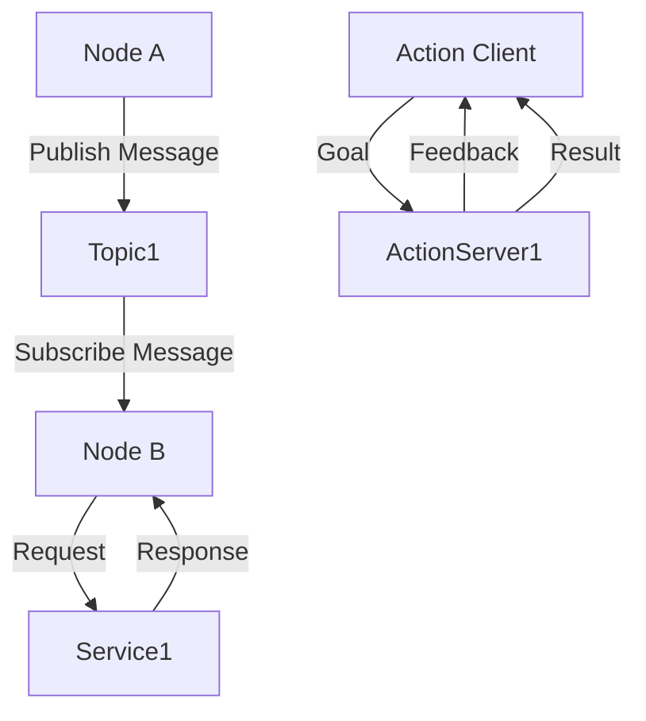

# ROS 2 Architecture

## Overview

This chapter introduces ROS 2 (Robot Operating System 2), a flexible framework for writing robot software. We will explore its core architectural components—nodes, topics, services, and actions—and understand how they facilitate real-time communication within a robotic system. ROS 2 is often conceptualized as the "nervous system" of a robot, providing the necessary infrastructure for different software modules to communicate and coordinate effectively. This foundational understanding is crucial for developing complex robotic applications, especially those involving distributed systems and real-time data exchange.

## Key Concepts

- **Nodes**: Individual executable processes in ROS 2 that perform specific tasks (e.g., a camera driver node, a navigation node).
- **Topics**: A publish/subscribe communication mechanism where nodes publish messages to named topics, and other nodes subscribe to receive those messages. Ideal for streaming data like sensor readings or joint states.
- **Services**: A request/response communication mechanism where a client node sends a request to a service server node, and the server returns a single response. Suitable for infrequent, single-shot interactions.
- **Actions**: A long-running, goal-oriented communication mechanism that provides feedback and allows for preemption. Used for tasks like navigating to a goal or performing a complex manipulation sequence.
- **DDS (Data Distribution Service)**: The underlying communication middleware that ROS 2 utilizes for reliable and efficient real-time data transfer.
- **`rclpy`**: The Python client library for ROS 2, enabling Python developers to write ROS 2 nodes and interact with the ROS 2 ecosystem.

## Subsections

### Nodes, topics, services, actions

At the heart of ROS 2's architecture are its communication primitives: nodes, topics, services, and actions. **Nodes** are the fundamental building blocks—isolated processes responsible for a single module of functionality. For example, one node might control a robot's motors, while another processes camera data. **Topics** provide a asynchronous, many-to-many communication channel. A node publishes data (messages) to a topic, and any number of other nodes can subscribe to that topic to receive the data. This is ideal for continuous data streams. **Services** offer a synchronous, one-to-one request-response pattern, useful for tasks that require an immediate result, like querying a robot's status. Finally, **Actions** are designed for long-running, preemptable tasks. An action client sends a goal to an action server, which executes the task while providing periodic feedback on its progress and allowing the client to cancel the goal if needed. Together, these primitives form a robust communication framework.

### rclpy for Python-based agents

`rclpy` is the official Python client library for ROS 2. It provides a Pythonic interface to all core ROS 2 functionalities, allowing developers to write nodes, publish to topics, subscribe to topics, create and call services, and implement action clients and servers using Python. This is particularly valuable for AI researchers and developers who often work with Python for machine learning, computer vision, and high-level control algorithms. `rclpy` handles the complexities of interfacing with the underlying C++ ROS 2 core (`rcl`) and the DDS middleware, enabling Python-based agents to seamlessly integrate into the ROS 2 ecosystem. It is a critical component for building sophisticated, intelligent robotic behaviors using Python.

### Real-time communication concepts

Real-time communication is paramount in robotics to ensure timely and predictable responses to sensory input and control commands. ROS 2 is built on top of DDS (Data Distribution Service), which is a middleware standard designed for real-time systems. DDS provides features like quality of service (QoS) policies, allowing developers to specify requirements for reliability, latency, and durability of message exchange. These policies ensure that critical data, such as emergency stop signals or motor commands, are delivered with high priority and determinism. While ROS 2 aims for soft real-time performance (meaning it tries to meet deadlines but can occasionally miss them), its architecture with DDS provides a significant improvement over ROS 1 in handling time-sensitive operations, making it suitable for a wider range of robotic applications where precise timing is essential.

## Learning Goals

- Understand ROS 2’s communication model.
- Recognize ROS 2 as the nervous system of a robot.

## Mini Diagram



## Short Example

```python
import rclpy
from rclpy.node import Node
from std_msgs.msg import String

class MinimalPublisher(Node):
    def __init__(self):
        super().__init__('minimal_publisher')
        self.publisher_ = self.create_publisher(String, 'topic', 10)
        timer_period = 0.5  # seconds
        self.timer = self.create_timer(timer_period, self.timer_callback)
        self.i = 0

    def timer_callback(self):
        msg = String()
        msg.data = f'Hello from ROS 2: {self.i}'
        self.publisher_.publish(msg)
        self.get_logger().info(f'Publishing: "{msg.data}"')
        self.i += 1

def main(args=None):
    rclpy.init(args=args)

    minimal_publisher = MinimalPublisher()

    rclpy.spin(minimal_publisher)

    minimal_publisher.destroy_node()
    rclpy.shutdown()

if __name__ == '__main__':
    main()

```

## References

- [APA citation for: ROS 2 concepts and architecture]
- [APA citation for: rclpy documentation]
- [APA citation for: DDS real-time communication]
