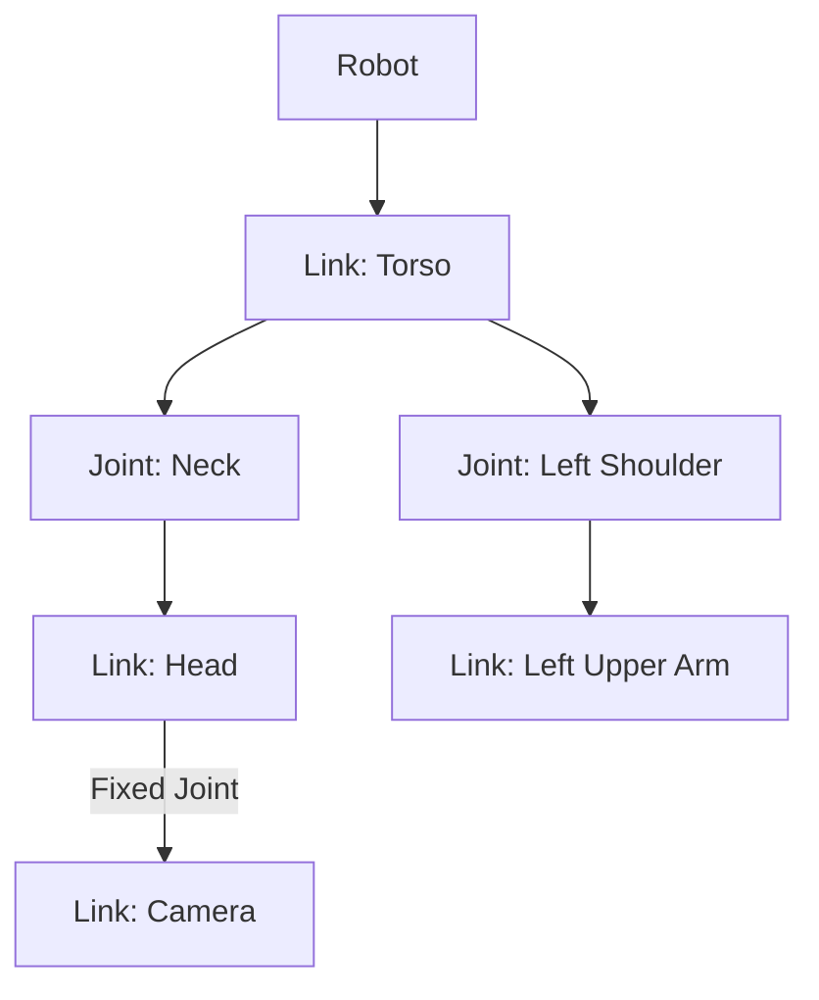

# Robot Models & URDF

## Overview

This chapter delves into the representation of robot structures using URDF (Universal Robot Description Format). We will explore the fundamental components of a URDF file, including links, joints, and sensors, and understand how they are interconnected to define a robot's physical and kinematic properties. A basic humanoid URDF example will be provided to illustrate these concepts practically. Interpreting robot models is a crucial skill for anyone working with robotics, as it forms the basis for simulation, visualization, motion planning, and integration with advanced AI platforms like NVIDIA Isaac Sim.

## Key Concepts

- **URDF (Universal Robot Description Format)**: An XML file format in ROS that describes the kinematic and dynamic properties of a robot, as well as its visual and collision properties.
- **Links**: Represent the rigid bodies of a robot (e.g., torso, upper arm, wheel). They have mass, inertia, and visual/collision geometries.
- **Joints**: Connect two links and define their relative motion (e.g., revolute, prismatic, fixed). Each joint has an axis, origin, and limits.
- **Sensors (in URDF context)**: While URDF primarily defines the robot's physical structure, it can include placeholders or extensions to describe attached sensors and their frames.
- **Kinematic Tree**: The hierarchical structure formed by links and joints, starting from a base link and branching out to the robot's end-effectors.

## Subsections

### URDF structure

A URDF file is an XML document that precisely describes a robot's physical characteristics. The root element is `<robot>`, which contains a collection of `<link>` and `<joint>` elements. Each `<link>` defines a rigid body with its associated visual (how it looks), collision (how it interacts physically), and inertial (mass and moment of inertia) properties. `<joint>` elements specify how two links are connected and their degrees of freedom. Joints can be revolute (rotating), prismatic (sliding), or fixed (no movement). The hierarchical relationship between links and joints forms a kinematic chain, enabling a software model to understand the robot's structure and how its parts move relative to each other.

### Linking joints, links, sensors

The `link` and `joint` elements are fundamental to URDF. A `<joint>` always connects a `parent` link to a `child` link, defining the `type` of movement allowed between them. For instance, a revolute joint allows rotation around a specified axis. The `origin` tag within a joint specifies the transform from the parent link's frame to the child link's frame. While URDF itself does not directly define sensor functionality, sensors are typically attached to a specific `link` using a `<link>` element to represent the sensor body and a `<joint type="fixed">` to attach it. This establishes the sensor's precise position and orientation relative to the robot's body, which is crucial for accurate perception data in simulation and real-world applications.

### Basic humanoid URDF example

Consider a very simplified humanoid robot. Its URDF might start with a `<link name="base_link">` representing the torso. From the `base_link`, a `<joint name="left_shoulder_joint" type="revolute">` could connect to a `<link name="left_upper_arm">`. This pattern continues down to the hands and legs. Similarly, a `<link name="head_link">` connected by a `<joint name="neck_joint" type="revolute">` would define the head. Sensors, such as a camera, could be attached to the `head_link` with a fixed joint. This modular, hierarchical approach allows for complex robot designs to be broken down into manageable components, each precisely defined in terms of its geometry, mass, and how it moves in relation to its neighbors. The resulting XML file provides a complete, unambiguous description of the robot's physical form.

## Learning Goals

- Ability to interpret a robot model.
- Prepare for simulation and Isaac integration.

## Mini Diagram



## Short Example

```xml
<?xml version="1.0" ?>
<robot name="simple_robot">
  <link name="base_link">
    <visual>
      <geometry>
        <box size="0.6 0.4 0.2" />
      </geometry>
    </visual>
  </link>

  <link name="gripper_link">
    <visual>
      <geometry>
        <box size="00.1 0.1 0.1" />
      </geometry>
    </visual>
  </link>

  <joint name="base_to_gripper" type="prismatic">
    <parent link="base_link" />
    <child link="gripper_link" />
    <origin xyz="0 0 0.2" />
    <axis xyz="0 0 1" />
    <limit lower="0" upper="0.5" effort="100" velocity="100" />
  </joint>
</robot>

```

## References

- [APA citation for: URDF specification]
- [APA citation for: Links and joints in robotics]
- [APA citation for: Robot sensor integration with URDF]
