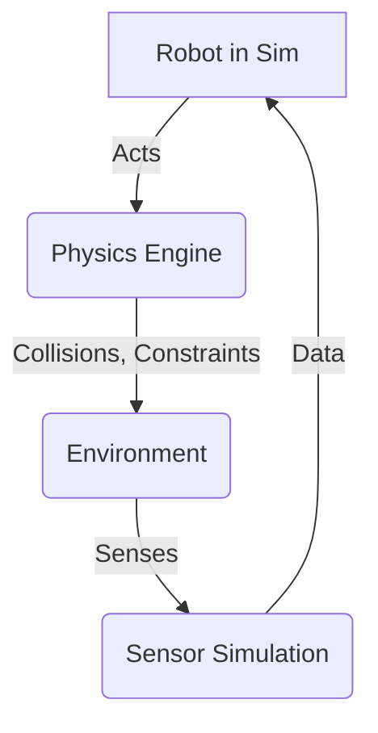

# Simulation Fundamentals

## Overview

This chapter introduces the fundamental concepts of physics-based simulation in robotics, a crucial tool for developing and testing intelligent systems without relying solely on physical hardware. We will explore the role of physics engines in replicating real-world phenomena like collisions, constraints, and materials. A significant focus will be placed on how various sensors, such as LiDAR, depth cameras, and IMUs, are digitally represented and simulated to provide realistic perception data. Understanding these fundamentals is essential for creating effective digital twins and preparing for advanced AI training and validation workflows.

## Key Concepts

- **Physics Engines**: Software libraries that simulate physical interactions (e.g., gravity, friction, collisions) between objects in a virtual environment, providing realistic motion and behavior.
- **Collisions**: The detection and resolution of interactions when two or more simulated objects come into contact.
- **Constraints**: Rules that limit the degrees of freedom of objects, often used to model joints in robotic systems or fixed objects in an environment.
- **Materials**: Properties assigned to virtual objects that influence their physical interactions, such as friction coefficients, restitution (bounciness), and density.
- **Sensor Simulation**: The process of creating virtual sensors that mimic the data output of real-world sensors (e.g., generating synthetic camera images, LiDAR point clouds).

## Subsections

### Physics engines

Physics engines are the computational core of robotic simulations. They are responsible for accurately modeling physical laws within a virtual environment, including gravity, mass, inertia, and forces like friction and damping. By applying these laws to the digital representations of robots and their surroundings, physics engines can predict how objects will move, collide, and interact. This capability is invaluable for testing robot control algorithms, validating mechanical designs, and generating vast amounts of synthetic data for AI training. Popular examples include Gazebo's underlying physics engines (like ODE, Bullet, DART) and Unity's built-in PhysX engine, each offering different strengths in terms of accuracy, performance, and features.

### Collisions, constraints, materials

Realistic physical interaction in simulation relies on correctly modeling collisions, constraints, and materials. **Collisions** ensure that objects do not pass through each other and that impact forces are calculated accurately. Physics engines use various algorithms for collision detection and response. **Constraints** are used to define how objects are connected or limited in their movement. For instance, revolute joints in a robot arm are a type of constraint, allowing rotation around a single axis. **Materials** assign physical properties to objects, such as roughness for friction, bounciness for restitution, and density for mass calculations. The precise configuration of these elements is critical for creating a digital twin that behaves in a physically plausible manner, allowing for effective development and testing of robotic systems.

### Sensor simulation (LiDAR, depth, IMU)

Sensor simulation is a cornerstone of digital twin technology. It involves creating virtual counterparts to real-world sensors that produce realistic data streams within the simulated environment. For example, a **LiDAR** sensor simulation might cast virtual rays and return distance measurements to the nearest objects, mimicking a real LiDAR scan. **Depth cameras** can simulate their output by rendering depth maps of the scene, providing per-pixel distance information. **IMUs (Inertial Measurement Units)** are simulated by tracking the virtual robot's angular velocity, linear acceleration, and orientation relative to the world frame. High-fidelity sensor simulation is paramount for training perception algorithms for tasks like object recognition, localization, and mapping, as it allows for controlled data generation under various environmental conditions without the need for extensive real-world data collection.

## Learning Goals

- Understand the role of physics-based simulation.
- Know how sensors are digitally represented.

## Mini Diagram



## Short Example

```python
# Conceptual Python class for a simulated LiDAR sensor
class SimulatedLiDAR:
    def __init__(self, range_max=10.0, num_beams=360):
        self.range_max = range_max
        self.num_beams = num_beams
        self.scan_data = [float('inf')] * num_beams

    def simulate_scan(self, environment_objects, robot_pose):
        # In a real simulator, this would involve ray casting into the 3D environment
        # For this conceptual example, we just populate some dummy data
        print(f"Simulating LiDAR scan from {robot_pose}...")
        for i in range(self.num_beams):
            # Simulate some varying distances
            distance = (self.range_max / self.num_beams) * ((i + robot_pose[2]*10) % self.num_beams)
            if distance < self.range_max:
                self.scan_data[i] = round(distance, 2)
            else:
                self.scan_data[i] = float('inf')
        print(f"Generated scan data (first 10): {self.scan_data[:10]}...")
        return self.scan_data

if __name__ == "__main__":
    lidar = SimulatedLiDAR()
    # Simulate a robot at a certain (x, y, yaw) pose
    robot_pose = (0, 0, 0.5)
    lidar.simulate_scan(environment_objects=[], robot_pose=robot_pose) # environment_objects would be from simulator

```

## References

- [APA citation for: Physics engine principles]
- [APA citation for: Collision detection and resolution]
- [APA citation for: Sensor modeling in robotics simulation]
