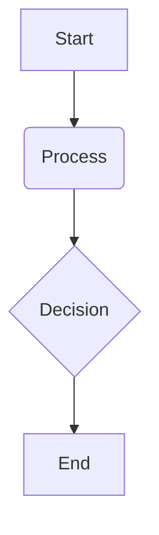

# Isaac Sim

## Overview

This chapter introduces NVIDIA Isaac Sim, a powerful simulation platform for robotics. We will explore its capabilities in photorealistic rendering, domain randomization, and synthetic data generation, highlighting how these features accelerate AI training for robots.

## Key Concepts

-   **Isaac Sim**: A scalable and extensible robotics simulation application and synthetic data generation tool built on NVIDIA Omniverse.
-   **Photorealistic Rendering**: Generating highly realistic images and sensor data within a simulation environment.
-   **Domain Randomization**: Varying non-essential aspects of a simulation environment (e.g., textures, lighting, object positions) to improve the robustness and generalization of trained policies to the real world.
-   **Synthetic Data Generation**: Creating artificial datasets from simulations to train AI models, especially useful when real-world data is scarce or expensive to acquire.

## Subsections

### Photorealistic Rendering

Isaac Sim leverages advanced rendering capabilities to create visually accurate and detailed simulation environments. This photorealism is crucial for generating synthetic data that closely mimics real-world sensor inputs, allowing AI models to be trained effectively in simulation and deployed with higher success rates in physical robots.

### Domain Randomization

To bridge the "reality gap" between simulation and the real world, Isaac Sim employs domain randomization. By randomly varying aspects of the simulation—such as lighting conditions, object textures, camera positions, and noise levels—the trained AI models become more robust and less susceptible to the specific characteristics of the simulation environment. This technique significantly enhances the transferability of policies learned in simulation to real-world scenarios.

### Synthetic Data Pipelines

Synthetic data generation is the process of creating artificial data using simulations. Isaac Sim excels at this by providing tools to programmatically generate large datasets of varied scenarios. This is particularly valuable for training deep learning models, where acquiring and labeling real-world data can be prohibitively expensive and time-consuming. Synthetic data pipelines in Isaac Sim allow for precise control over data characteristics, including annotations (e.g., bounding boxes, segmentation masks) that are automatically generated, thereby streamlining the development and testing of robust AI perception systems.

## Learning Goals

- Understand how Isaac Sim is used for photorealistic rendering, domain randomization, and synthetic data generation.
- Explain the benefits of synthetic data and domain randomization in the context of robot perception training.

## Mini Diagram



## Short Example

```python
# Example code snippet
print("Hello, Physical AI!")
```

## References

- *NVIDIA Isaac Sim Documentation*. (n.d.). NVIDIA Omniverse. Retrieved December 6, 2025, from https://docs.isaacsim.omniverse.nvidia.com/latest/index.html
- Tobin, J., Fong, R., Ray, A., Schneider, J., Zaremba, W., & Abbeel, P. (2017). *Domain randomization for transferring deep neural networks from simulation to the real world*. 2017 IEEE/RSJ International Conference on Intelligent Robots and Systems (IROS), 23-30.
- To, T., & Canny, J. (2018). *Sim-to-real: Learning from simulation for real-world manipulation*. 2018 IEEE International Conference on Robotics and Automation (ICRA), 1-8.
