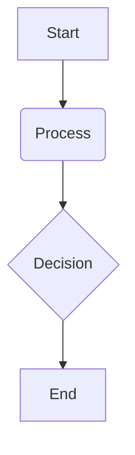

# Isaac ROS & Navigation

## Overview

This chapter explores the Isaac ROS ecosystem, a collection of hardware-accelerated packages for the Robot Operating System (ROS) that are optimized for NVIDIA GPUs and Jetson platforms. We will focus on how these packages, particularly for Visual SLAM (VSLAM) and navigation (Nav2), enable advanced perception and autonomy in robots.

## Key Concepts

-   **Isaac ROS**: A set of ROS 2 packages that provide hardware acceleration for perception, navigation, and manipulation tasks on NVIDIA hardware.
-   **VSLAM (Visual Simultaneous Localization and Mapping)**: A technique that allows a robot to build a map of its environment and simultaneously track its own position within that map using visual information.
-   **Nav2 (ROS 2 Navigation Stack)**: The second generation of the ROS navigation stack, providing a flexible and configurable framework for robot navigation, including localization, path planning, and obstacle avoidance.

## Subsections

### VSLAM

Isaac ROS includes a hardware-accelerated VSLAM package that leverages the power of NVIDIA GPUs to perform real-time localization and mapping. This is crucial for robots operating in unknown or dynamic environments where a pre-existing map is not available. The Isaac ROS VSLAM package provides high-performance, low-latency odometry and mapping capabilities, essential for robust navigation.

### Perception modules

Beyond VSLAM, Isaac ROS offers a suite of hardware-accelerated perception packages. These include modules for object detection, segmentation, and depth estimation, all of which can be seamlessly integrated into a ROS 2 application. By offloading these computationally intensive tasks to the GPU, the CPU is freed up for other critical robot functions, leading to improved overall system performance.

### Navigation pipeline (Nav2)

The Isaac ROS packages are designed to integrate smoothly with Nav2, the standard navigation stack in ROS 2. By providing high-quality odometry from VSLAM and perception data from other Isaac ROS modules, the navigation pipeline can achieve robust and reliable performance. This allows robots to navigate complex environments, avoid obstacles, and reach their goals efficiently.

## Learning Goals

- Understand how Isaac ROS modules contribute to robot mapping, localization, and navigation.
- Identify key Isaac ROS modules for perception and navigation and explain their function within a robotic system.

## Mini Diagram



## Short Example

```python
# Example code snippet
print("Hello, Physical AI!")
```

## References

- *NVIDIA Isaac ROS*. (n.d.). NVIDIA Developer. Retrieved December 6, 2025, from https://developer.nvidia.com/isaac/ros
- Macenski, S., Martin, F., White, R., & Ginés, J. F. C. (2020). *The marathon 2: A navigation system*. 2020 IEEE/RSJ International Conference on Intelligent Robots and Systems (IROS), 1-8.
- Cadena, C., Carlone, L., Carrillo, H., Latif, Y., Scaramuzza, D., Neira, J., Reid, I., & Leonard, J. J. (2016). *Past, present, and future of simultaneous localization and mapping: Toward the robust-perception age*. IEEE Transactions on Robotics, 32(6), 1309-1332.
