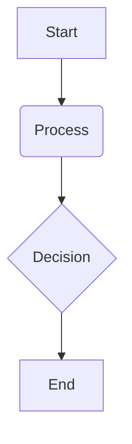

# Capstone Pipeline Overview

## Overview

This chapter brings together the concepts from the previous chapters to provide a high-level overview of a complete Vision-Language-Action (VLA) pipeline. We will trace the flow of information from a user's spoken command to the robot's physical action, illustrating how different AI and robotics components work together to achieve a goal.

## Key Concepts

-   **VLA Pipeline**: The end-to-end process of translating a high-level user command into a sequence of robot actions, encompassing speech recognition, language understanding, planning, navigation, and manipulation.
-   **Data Flow**: The movement of information through the different stages of the VLA pipeline, from sensory input to motor output.
-   **High-Level Architecture**: The overall structure of the VLA system, showing the major components and their interconnections.

## Subsections

### Voice → Plan → Navigate → Manipulate

We will examine the four main stages of our capstone VLA pipeline:
1.  **Voice**: The pipeline begins with the user issuing a spoken command, which is transcribed into text.
2.  **Plan**: The transcribed text is then processed by a large language model to generate a high-level plan.
3.  **Navigate**: The robot uses the plan to navigate to the target location, avoiding obstacles along the way.
4.  **Manipulate**: Once at the target location, the robot performs the desired manipulation task.

### High-level architecture

We will present a high-level architectural diagram of the VLA system, showing how the different components (e.g., speech recognition module, LLM planner, navigation stack, manipulation controller) are connected and how they communicate with each other.

### Data flow diagrams

To further clarify the workings of the VLA pipeline, we will use data flow diagrams to illustrate how data is transformed and passed between the different stages of the system.

## Learning Goals

- Understand the high-level architecture of a complete VLA pipeline.
- Sketch a data flow diagram for a Voice → Plan → Navigate → Manipulate pipeline.

## Mini Diagram



## Short Example

```python
# Example code snippet
print("Hello, Physical AI!")
```

## References

- Brohan, A., Brown, N., Carbune, V., Chebotar, Y., Dabis, J., Erev, I., ... & Vanhoucke, V. (2023). *RT-2: Vision-language-action models transfer web knowledge to robotic control*. arXiv preprint arXiv:2307.15818.
- Zeng, A., Attarian, M., Ichter, B., Choromanski, K., Nair, A., Li, T., ... & Florence, P. (2022). *Socratic models: Composing zero-shot multimodal reasoning with language*. arXiv preprint arXiv:2204.00598.
- Sha, L., Zhao, S., Wu, D., Zhang, B., Chen, S., & Li, B. (2023). *Chatgpt for robotics: An outlook*. arXiv preprint arXiv:2308.01212.
