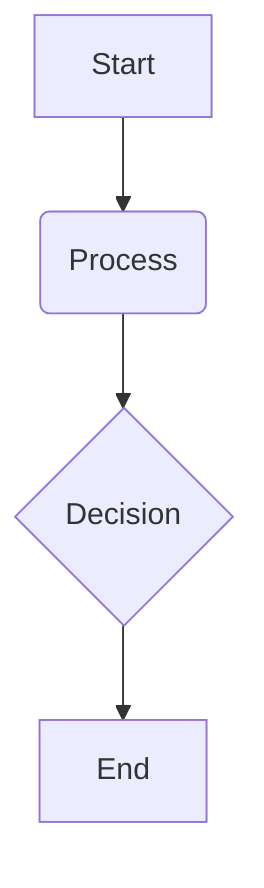

# VLA Systems Overview

## Overview

This chapter provides an overview of Vision-Language-Action (VLA) systems, which are at the forefront of enabling more natural and intuitive human-robot interaction. We will explore how these systems integrate advancements in natural language processing, computer vision, and AI planning to allow robots to understand and execute high-level commands.

## Key Concepts

-   **VLA (Vision-Language-Action)**: A type of AI system that connects natural language understanding, visual perception, and action generation to enable robots to perform tasks based on high-level instructions.
-   **Whisper**: An automatic speech recognition (ASR) system developed by OpenAI that can transcribe spoken language into text with high accuracy.
-   **LLM (Large Language Model)**: A large-scale neural network model trained on vast amounts of text data, capable of understanding and generating human-like text for a variety of tasks, including planning and reasoning.
-   **High-Level Action Generation**: The process of translating a high-level instruction (e.g., "get me a snack from the kitchen") into a sequence of concrete actions that a robot can execute.

## Subsections

### Whisper for voice input

At the beginning of a VLA pipeline is the ability to understand spoken commands. We will explore how state-of-the-art speech recognition systems like OpenAI's Whisper can be used to accurately transcribe human voice into text, providing a robust input for the language understanding component of the VLA system.

### LLM-driven planning

Once a command is transcribed, a Large Language Model (LLM) is used to interpret the user's intent and generate a high-level plan to achieve the goal. This involves breaking down the command into a series of logical steps that the robot needs to follow. We will discuss how the reasoning capabilities of LLMs can be leveraged for this task.

### High-level action generation

The final step in the VLA pipeline is to translate the high-level plan generated by the LLM into a sequence of concrete actions that the robot can execute. This involves mapping the abstract steps of the plan to the specific capabilities of the robot's hardware and control system.

## Learning Goals

- Understand the foundational concepts of VLA systems.
- Explain how voice input, LLMs, and high-level action generation combine in a VLA system.

## Mini Diagram



## Short Example

```python
# Example code snippet
print("Hello, Physical AI!")
```

## References

- Radford, A., Kim, J. W., Hallacy, C., Ramesh, A., Goh, G., Agarwal, S., ... & Sutskever, I. (2022). *Learning transferable visual models from natural language supervision*. In International Conference on Machine Learning (pp. 8748-8763). PMLR.
- Ahn, M., Brohan, A., Brown, N., Carbune, V., Choromanski, K., Collins, T., ... & Hinton, G. (2022). *Do as I can, not as I say: Grounding language in robotic affordances*. arXiv preprint arXiv:2204.01691.
- Li, Y., Madaan, A., Liu, S., Zha, S., Liu, B., & Anandkumar, A. (2023). *ChatGPT for Robotics: Design Principles and Model Abilities*. arXiv preprint arXiv:2306.17582.
