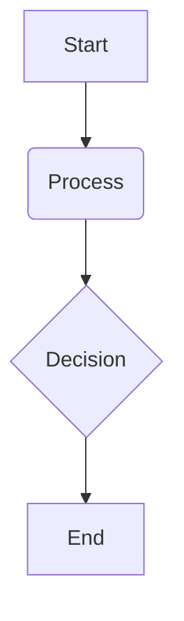

# Hardware Overview

## Overview

This chapter provides an overview of the hardware ecosystem that powers Physical AI and robotics. We will explore the different types of computational hardware, from powerful workstations for development and simulation to embedded systems for onboard processing. We will also cover the various sensors that enable robots to perceive their environment and the humanoid robot platforms that bring everything together.

## Key Concepts

-   **Workstations**: High-performance computers used for developing, training, and simulating complex AI models and robotic systems.
-   **Embedded Systems (e.g., Jetson kits)**: Compact, low-power computing devices designed to be integrated into robotic platforms for onboard processing of AI and robotics workloads.
-   **Sensors**: Devices that enable a robot to perceive its environment, including cameras, LiDAR, IMUs, and tactile sensors.
-   **Humanoid Robots**: Robotic platforms designed to mimic the human form, providing a versatile solution for operating in human-centric environments.

## Subsections

### Workstations

We will discuss the role of powerful workstations in the development of Physical AI systems. These machines are essential for tasks such as training large AI models, running computationally intensive simulations, and visualizing complex data. We will cover the key components of a robotics development workstation, including powerful GPUs, ample RAM, and fast storage.

### Jetson kits

NVIDIA Jetson kits are powerful yet compact embedded systems that are widely used in robotics for onboard AI processing. We will explore the different models in the Jetson family and discuss how they can be used to deploy AI models and robotics software on a physical robot.

### Sensors

Sensors are the eyes and ears of a robot. We will provide an overview of the most common types of sensors used in robotics, including cameras (monocular, stereo, RGB-D), LiDAR for 3D mapping, IMUs for orientation tracking, and tactile sensors for interaction with objects.

### Humanoid options

Finally, we will look at some of the humanoid robot platforms that are available for research and development. We will discuss the trade-offs between different platforms in terms of cost, capabilities, and community support.

## Learning Goals

- Understand the different types of hardware used in Physical AI.
- Identify common hardware components and explain their basic function.

## Mini Diagram



## Short Example

```python
# Example code snippet
print("Hello, Physical AI!")
```

## References

- Workstation Specialist. (n.d.). *The Ultimate AI Workstation Build Guide*. Retrieved December 6, 2025, from https://workstationspecialist.com/ultimate-ai-workstation-build-guide/
- NZO. (n.d.). *Best PC for AI and Machine Learning in 2025*. Retrieved December 6, 2025, from https://nzocloud.com/blog/best-pc-for-ai-machine-learning-in-2025
- NVIDIA. (n.d.). *NVIDIA Jetson Developer Kits*. Retrieved December 6, 2025, from https://developer.nvidia.com/embedded/jetson-developer-kits
- NVIDIA. (n.d.). *NVIDIA Jetson AGX Thor Powers Next-Gen AI Robots*. Retrieved December 6, 2025, from https://blogs.nvidia.com/blog/2022/09/20/nvidia-jetson-agx-thor-robot-ai/
- Roboticsbook.org. (n.d.). *Robot Vision*. Retrieved December 6, 2025, from https://www.roboticsbook.org/S10_vision/
- Analog Devices. (n.d.). *Inertial Measurement Unit (IMU)*. Retrieved December 6, 2025, from https://www.analog.com/en/technical-articles/inertial-measurement-unit-imu.html
- Pressure Profile Systems. (n.d.). *Tactile Sensors for Robotics and Automation*. Retrieved December 6, 2025, from https://www.pressureprofile.com/applications/robotics-automation/
- Humanoid Robotics Technology. (n.d.). *Top Humanoid Robots of 2024*. Retrieved December 6, 2025, from https://humanoidroboticstechnology.com/humanoid-robots-2024/
- Agility Robotics. (n.d.). *Digit: The Humanoid Robot Designed for Logistics Work*. Retrieved December 6, 2025, from https://agilityrobotics.com/digit
