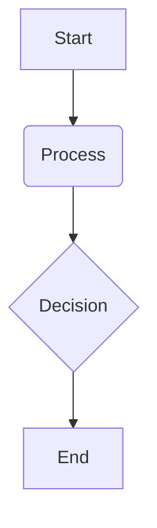

# Review & Next Steps

## Overview

This concluding chapter provides a comprehensive review of the key concepts covered throughout the "AI-Humanoid Robotics Book." We will revisit the foundational aspects of Physical AI, delve into the practical frameworks like ROS 2, and explore advanced topics such as digital twins, Isaac Sim, VLA systems, and hardware considerations. Finally, we will outline potential avenues for further learning and hands-on implementation, empowering readers to continue their journey in the dynamic field of AI-humanoid robotics.

## Key Concepts

-   **Summary of Modules**: A concise recap of the core themes and essential takeaways from each major section of the book.
-   **Continued Learning**: Resources and strategies for deepening understanding in specific areas of AI and robotics.
-   **Hands-on Implementation**: Guidance on practical projects, simulations, and real-world robot interactions to apply learned concepts.

## Subsections

### Summary of all modules

We will summarize the critical insights from each part of the book, from the philosophical underpinnings of Physical AI and embodied intelligence to the practicalities of ROS 2, URDF, and simulation environments like Gazebo and Unity. We will also touch upon the cutting-edge applications of Isaac Sim, Vision-Language-Action systems, and the essential hardware considerations.

### How to continue learning robotics

To foster ongoing engagement, this section will provide recommendations for advanced courses, online communities, relevant research papers, and open-source projects. We will also suggest practical approaches to self-study and skill development in robotics.

### Course extension possibilities

For those interested in a more structured learning path, we will outline potential extensions to this book's content. This might include advanced topics such as reinforcement learning for robot control, ethical considerations in AI robotics, human-robot interaction design, or specialized applications in fields like healthcare or manufacturing.

## Learning Goals

- Summarize the key concepts from each module.
- Identify resources for deeper engagement and further learning.

## Mini Diagram



## Short Example

```python
# Example code snippet
print("Hello, Physical AI!")
```

## References

- Class Central. (n.d.). *100 Best Robotics Courses*. Retrieved December 6, 2025, from https://www.classcentral.com/report/best-robotics-courses/
- The Construct. (n.d.). *Robotics & ROS Online Courses*. Retrieved December 6, 2025, from https://www.theconstruct.ai/robotics-ros-online-courses/
- Think Robotics. (n.d.). *Ethical Issues in AI Robotics: A Comprehensive Guide*. Retrieved December 6, 2025, from https://thinkrobotics.com/ethical-issues-in-ai-robotics/
- NVIDIA. (n.d.). *The Future of AI is Physical AI*. Retrieved December 6, 2025, from https://blogs.nvidia.com/blog/2024/03/18/what-is-physical-ai/
